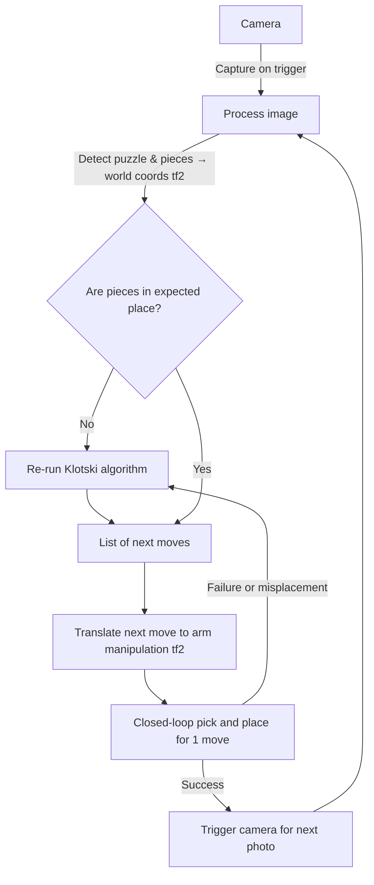

# MTRN4231 Klotski Solver

## Table of Contents

- [Overview](#-overview)
- [System Architecture](#️-system-architecture)
- [Technical Components](#-technical-components)
- [Installation and Setup](#-installation-and-setup)
- [Running the System](#️-running-the-system)
- [Development](#-development)
- [Results and Demonstration](#-results-and-demonstration)
- [Discussion and Future Work](#-discussion-and-future-work)
- [Contributors and Roles](#-contributors-and-roles)
- [Repository Structure](#-repository-structure)
- [References and Acknowledgements](#-references-and-acknowledgements)

A ROS2-based robotic system for solving the Klotski sliding puzzle using computer vision, path planning, and robotic manipulation with a UR5e robot arm.

## 📋 Overview

Klotski is a classic sliding-block puzzle in which blocks of varying sizes (1×1, 1×2, 2×1, and 2×2) must be maneuvered within a 4×5 confined board. The traditional objective is to guide the largest 2×2 block to the exit at the bottom.

This project implements an automated Klotski puzzle solver that:

- **Senses**: Uses computer vision to detect the current puzzle state and board position via ArUco markers
- **Plans**: Generates optimal move sequences using BFS-based path planning to reach the goal configuration
- **Acts**: Controls a UR5e robotic arm with a custom gripper to physically manipulate puzzle pieces
- **Monitors**: Provides a web-based dashboard for real-time control, visualization, and safety monitoring

The system continuously observes a physical Klotski board, tracks the board state, and when prompted, computes the shortest sequence of moves needed to reach a specified goal state. It can provide single-step hints or execute complete solutions autonomously.

## 🏗️ System Architecture

### RQT Node Graph


> *Generated using `rqt_graph` showing active nodes and topic connections.* Filtered out internal ROS2 nodes for clarity.

### Package-Level Interaction

<iframe frameborder="2" style="width:100%;height:500px;" src="https://viewer.diagrams.net/?tags=%7B%7D&lightbox=1&highlight=0000ff&edit=_blank&layers=1&nav=1&title=system_architecture.drawio&dark=auto#Uhttps%3A%2F%2Fraw.githubusercontent.com%2Falanchoi00%2Fmtrn4231-klotski-solver%2FFinal_README%2Fsystem_architecture.drawio"></iframe>

> *Interactive diagram generated with [draw.io](https://app.diagrams.net/).*

### Behaviour tree

Below is a high-level flowchart of the system's operational loop:



### Node Overview

TODO

### Custom ROS2 Interfaces

The system defines several custom ROS2 messages, services, and actions to facilitate communication between nodes.

<details>
<summary><strong>Messages</strong></summary>

| Message | Description |
|---------|-------------|
| `Board.msg` | Board state with piece positions |
| `BoardSpec.msg` | Board dimensions (4×5 grid) |
| `BoardState.msg` | Complete board state with pose |
| `Cell.msg` | Grid cell coordinates (col, row) |
| `Piece.msg` | Piece definition (type, color, cells) |
| `Move.msg` | Single move (piece + target cell) |
| `MoveList.msg` | Sequence of moves |
| `HSVRange.msg` | HSV color range for detection |
| `HSVRanges.msg` | Multiple color ranges |
| `GripperCommand.msg` | Gripper open/close commands |
| `UICommand.msg` | Dashboard commands |

</details>

<details>
<summary><strong>Services</strong></summary>

| Service | Description |
|---------|-------------|
| `SolveBoard.srv` | Request optimal path from current to goal state |
| `CaptureBoard.srv` | Capture and return current board state |
| `GetHSVRanges.srv` | Get current color detection ranges |
| `SetHSVRanges.srv` | Update color detection ranges |
| `ResetHSVRanges.srv` | Reset to default HSV ranges |
| `ExportHSVRangesYaml.srv` | Export HSV config to YAML |
| `GetSafetyZone.srv` | Get safety monitoring ROI |
| `SetSafetyZone.srv` | Set safety monitoring ROI |

</details>

<details>
<summary><strong>Actions</strong></summary>

| Action | Description |
|--------|-------------|
| `MovePiece.action` | Execute 5-phase manipulation sequence |
| `GripPiece.action` | Open/close gripper |

</details>

## 🔧 Technical Components

### Computer Vision Pipeline

The vision pipeline consists of four major stages:

1. **ArUco Detection**
   - ArUco markers (DICT_4X4_50, 65mm) placed at the four corners of the board are identified
   - Marker IDs: TL=0, TR=1, BL=2, BR=3
   - Their pixel and 3D positions are stored for transformations

2. **Board Isolation**
   - The detected ArUco marker positions compute a homography matrix
   - Applied to warp the camera view into a rectified top-down view of the board

3. **Grid Color Detection**
   - A 4×5 grid is overlaid on the rectified board image
   - HSV color masks identify the color of each grid cell
   - Configurable via dashboard color masker tool

4. **Board State Reconstruction**
   - Grid colors are converted to piece positions
   - In Klotski, this mapping is **injective** - each color configuration uniquely determines piece arrangement
   - Sliding-window detection identifies connected shapes

### End Effector

The custom end effector is a parallel gripper driven by a single servo motor. It consists primarily of laser-cut acrylic sheet and plywood.


- **Control**: Arduino-based serial communication
- **Actuation**: Single servo motor for parallel jaw movement
- **Feedback**: Contact state detection

### Safety System

Hand detection-based safety monitoring:

- MediaPipe Hands for real-time hand detection
- Configurable safety zone (ROI polygon)
- Immediate arm stop when hands detected in zone
- Automatic resume after hands clear for configurable frames

## 🚀 Installation and Setup

### Prerequisites

#### System Requirements

- **[Ubuntu 22.04](https://releases.ubuntu.com/jammy/)**
- **[ROS2 Humble](https://docs.ros.org/en/humble/Installation/Ubuntu-Install-Debs.html)**
- **[Node.js 18+](https://nodejs.org/en/download)** and npm
- **[Python 3.10+](https://www.python.org/downloads/)**
- **[OpenCV](https://opencv.org/)** with ArUco support
- **[MoveIt2](https://moveit.picknik.ai/humble/doc/tutorials/getting_started/getting_started.html)**

#### Required ROS2 Packages

```bash
# Core packages
sudo apt install ros-humble-rclpy ros-humble-std-msgs ros-humble-sensor-msgs

# TF2 for coordinate transforms
sudo apt install ros-humble-tf2-ros ros-humble-tf2-geometry-msgs

# ROS Bridge for web interface
sudo apt install ros-humble-rosbridge-server ros-humble-web-video-server

# Camera support
sudo apt install ros-humble-realsense2-camera

# UR5e Robot Driver and MoveIt
sudo apt install ros-humble-ur-robot-driver ros-humble-ur-moveit-config

# MoveIt2
sudo apt install ros-humble-moveit

# CV Bridge
sudo apt install ros-humble-cv-bridge
```

#### Python Dependencies

```bash
pip install opencv-python mediapipe pyserial scipy
```

### 1. Clone and Build ROS Workspace

```bash
cd ~/mtrn4231-klotski-solver
colcon build
source install/setup.bash
```

### 2. Install Dashboard Dependencies

```bash
cd src/dashboard_app
npm install
```

## ⚙️ Running the System

**For Real Robot:**

```bash
# Default camera transform
./runKlotski.sh

# With custom camera transform (x y z qx qy qz qw)
./runKlotski.sh 1.31 0.02 0.67 -0.40 0.00 0.92 0.01
```

**For Simulation:**

```bash
./runKlotskiSim.sh
```

> To access the dashboard, open <http://localhost:3000> in your browser.

## 🔧 Development

### Building Individual Packages

```bash
# Build specific packages
colcon build --packages-select pkg_brain pkg_sense

# Build with debug info
colcon build --cmake-args -DCMAKE_BUILD_TYPE=Debug

# Clean build
rm -rf build/ install/ log/
colcon build
```

### ROS2 Commands

```bash
# Check running nodes
ros2 node list

# Monitor topics
ros2 topic echo /board_state
ros2 topic hz /safety/stop

# Test services
ros2 service call /plan/solve klotski_interfaces/srv/SolveBoard "{...}"

# Test actions
ros2 action send_goal /arm_manipulation/move_piece klotski_interfaces/action/MovePiece "{...}"
```

### Camera Calibration

Use the calibration script to determine camera-to-robot transform:

```bash
python3 src/pkg_sense/scripts/calibrate_camera_tf.py --mode preview
python3 src/pkg_sense/scripts/calibrate_camera_tf.py --mode collect --samples 20
python3 src/pkg_sense/scripts/calibrate_camera_tf.py --mode compute
```

See `docs/CAMERA_CALIBRATION.md` for detailed instructions.

## 📈 Results and Demonstration

TODO

## 💬 Discussion and Future Work

TODO

## 👥 Contributors and Roles

- @alanchoi00 - Project Lead, System Architecture, Brain Node, UI Dashboard, Plan Node, Hand Safety Node
- @slammyh - Sense Node, Klotski board design
- @z5324144 - Arm Manipulation Node
- @Ram0Gan35h - Gripper Manipulation Node, End Effector Design

## 📁 Repository Structure

Below is an overview of the repository structure:

```txt
mtrn4231-klotski-solver
├── camera.sh (for launching realsense camera with correct parameters)
├── docs
│   └── ... (documentation files)
├── Images
│   └── ... (README images)
├── README.md
├── runKlotski.sh (for running full klotski system on real robot)
├── runKlotskiSim.sh (for running full klotski system in simulation)
├── setupFakeur5e.sh (for setting up UR5e simulation)
├── setupRealur5e.sh (for setting up real UR5e)
└── src
    ├── dashboard_app
    │   └── ...(Next.js dashboard application)
    ├── gripper_description
    │   └── ... (custom gripper URDF)
    ├── klotski_interfaces
    │   ├── action
    │   │   └── ... (custom action definitions)
    │   ├── msg
    │   │   └── ... (custom message definitions)
    │   └── srv
    │       └── ... (custom service definitions)
    ├── klotski_utils
    │   └── ...  (shared utilities - especially for parameter handling)
    ├── launch
    │   └── klotski.launch.py (main launch file for entire system)
    ├── pkg_brain
    │   ├── config
    │   │   └── brain.config.yaml (configurable parameters)
    │   ├── launch
    │   │   └── brain.launch.py (launch file for brain node)
    │   ├── pkg_brain
    │   │   ├── context.py (context management)
    │   │   ├── handlers
    │   │   │   └── ... (event handlers - following chain of responsibility pattern)
    │   │   ├── managers
    │   │   │   └── ... (various manager files, splitting responsibilities between UI, manipulation, planning, sensing)
    │   │   ├── task_brain.py (main brain node implementation)
    │   │   └── ui_modes.py (UI mode definitions)
    │   ├── config
    │   │   ├── arm.config.yaml (configuration for arm manipulator)
    │   │   └── gripper.config.yaml (configuration for gripper manipulator)
    │   ├── launch
    │   │   └── manipulation.launch.py (launch file for manipulation nodes)
    ├── pkg_manipulation
    │   ├── arm
    │   │   └── ... (C++ MoveIt-based UR5e arm manipulator)
    │   └── gripper
    │       └── ... (Python-based serial gripper manipulator)
    ├── pkg_plan
    │   └── ... (C++ path planning node with launch file and precomputed data)
    ├── pkg_sense
    │   ├── config
    │   │   ├── hand_safety.config.yaml (hand safety node config)
    │   │   ├── hsv_ranges.default.yaml (default HSV ranges for colour detection)
    │   │   └── sense.config.yaml (sense node config)
    │   ├── launch
    │   │   └── sense.launch.py (launch file for sense node)
    │   ├── pkg_sense
    │   │   ├── constants.py (constants used across the package)
    │   │   ├── exceptions.py (custom exceptions)
    │   │   ├── hand_safety_node.py (hand safety node implementation)
    │   │   ├── handlers
    │   │   │   └── ... (handlers for service requests)
    │   │   ├── managers
    │   │   │   └── ... (various manager files, splitting responsibilities between camera, board detection, color detection, transforms)
    │   │   ├── scripts
    │   │   │   └── ... (utility scripts e.g., mock camera, calibration)
    │   │   ├── sense_node.py (main sense node implementation)
    │   │   ├── services
    │   │   │   └── ... (FP service implementations)
    │   │   └── types.py (custom types used in the package)
    │   ├── scripts
    │   │   └── calibrate_camera_tf.py (script for calibrating camera transform)
    │   └── test_images (test images for mock camera)
    └── ur_with_gripper_description
        └── ... (UR5e with gripper URDF)
```

> Tree generated with `tree -L 4 -I 'build|install|log|node_modules'`

<details>

<summary><strong>Further details on repository structure - package level</strong> (click to expand)</summary>

<br/>

### `klotski_utils/`

Shared Python utilities across packages.

- `params.py` - Type-safe ROS2 parameter declaration helper (`declare_param[T]()`)

### `pkg_brain/`

**Task Orchestrator** - Central coordination node managing the complete solving pipeline.

**Node:** `task_brain`

**Responsibilities:**

- UI mode management (auto/step/pause/reset)
- Pipeline orchestration through handler chain
- 5-phase manipulation execution (IDLE → APPROACH → PICK_PLACE → RETREAT)
- Safety stop integration

**Subscriptions:**

| Topic | Type | Description |
|-------|------|-------------|
| `/board_state` | `BoardState` | Current sensed board state |
| `/ui/cmd` | `UICommand` | Dashboard commands |
| `/ui/goal` | `BoardState` | User-defined goal state |
| `/safety/stop` | `Bool` | Emergency stop signal |

**Publications:**

| Topic | Type | Description |
|-------|------|-------------|
| `/ui/events` | `String` | Status updates for dashboard |

**Service Clients:**

| Service | Type | Description |
|---------|------|-------------|
| `/plan/solve` | `SolveBoard` | Request path planning |

**Action Clients:**

| Action | Type | Description |
|--------|------|-------------|
| `/arm_manipulation/move_piece` | `MovePiece` | Arm manipulation |
| `/gripper_manipulation/grip_piece` | `GripPiece` | Gripper control |

### `pkg_sense/`

**Computer Vision Module** - Board state detection via camera and ArUco markers.

**Nodes:**

| Node | Description |
|------|-------------|
| `sense` | Main sensing node - ArUco detection, board isolation, color detection |
| `hand_safety_monitor` | Hand detection for safety stopping using MediaPipe |

**Vision Pipeline:**

1. **ArUco Detection** - Detect 4 corner markers (IDs 0-3, DICT_4X4_50, 65mm)
2. **Board Isolation** - Homography transform for top-down rectified view
3. **Color Detection** - HSV masking for piece identification per grid cell
4. **Board Reconstruction** - Sliding-window algorithm to identify pieces from colors

**Subscriptions:**

| Topic | Type | Description |
|-------|------|-------------|
| `/camera/camera/color/image_raw` | `Image` | Camera feed |
| `/camera/camera/color/camera_info` | `CameraInfo` | Camera intrinsics |

**Publications:**

| Topic | Type | Description |
|-------|------|-------------|
| `/board_state` | `BoardState` | Detected board state with pose |
| `/safety/stop` | `Bool` | Hand detection safety signal |
| `/safety/hand_detection_image` | `Image` | Annotated hand detection feed |

**TF Broadcasts:**

| Frame | Parent | Description |
|-------|--------|-------------|
| `aruco_X` | `camera_color_optical_frame` | Individual marker poses |
| `board` | `base_link` | Board origin (bottom-left corner) |

**Services:**

| Service | Type | Description |
|---------|------|-------------|
| `/sense/capture_board` | `CaptureBoard` | Capture current state |
| `/sense/get_hsv_ranges` | `GetHSVRanges` | Get color ranges |
| `/sense/set_hsv_ranges` | `SetHSVRanges` | Set color ranges |
| `/safety/get_zone` | `GetSafetyZone` | Get safety ROI |
| `/safety/set_zone` | `SetSafetyZone` | Set safety ROI |

### `pkg_plan/`

**Path Planning Module** - BFS-based Klotski solver with precomputed move database.

**Node:** `solve_service_node` (C++)

**Algorithm:**

- Uses precomputed adjacency graph (`possible_combinations.json`) of all valid Klotski states
- BFS search from current state to goal state
- Returns optimal move sequence

**Services:**

| Service | Type | Description |
|---------|------|-------------|
| `/plan/solve` | `SolveBoard` | Compute optimal path |

### `pkg_manipulation/`

**Robot Control Module** - UR5e arm and gripper control using MoveIt2.

**Nodes:**

| Node | Description |
|------|-------------|
| `arm_manipulator` | MoveIt-based arm motion planning and execution (C++) |
| `gripper_manipulator` | Arduino-controlled servo gripper via serial (Python) |

**Arm Manipulator Features:**

- Cartesian path planning for predictable linear motions
- Dynamic board pose subscription for accurate targeting
- Collision objects (table, walls, ceiling)
- Safety stop integration with immediate motion halt
- Configurable velocity/acceleration scaling

**Action Servers:**

| Action | Type | Description |
|--------|------|-------------|
| `/arm_manipulation/move_piece` | `MovePiece` | 5-phase manipulation |
| `/gripper_manipulation/grip_piece` | `GripPiece` | Gripper control |

**5-Phase Manipulation Sequence:**

1. **IDLE** - Ready state
2. **APPROACH** - Move above piece center
3. **PICK** - Descend to grip height, close gripper
4. **PLACE** - Move to target, open gripper
5. **RETREAT** - Rise to safe height

### `gripper_description/`

URDF description for the custom gripper end effector.

### `ur_with_gripper_description/`

Combined URDF for UR5e robot with custom gripper attached.

### `dashboard_app/`

**Web Interface** - Next.js application for real-time control and visualization.

**Technology Stack:**

- Next.js 14 + React 18
- TypeScript
- Tailwind CSS + shadcn/ui components
- roslib.js for ROS2 WebSocket communication

**Features:**

- Real-time board state visualization
- Interactive goal state editor
- Mode control (auto/step/pause/reset)
- HSV color range tuning
- Camera feed with safety zone overlay
- Hand detection monitor with ROI editing

**Key Components:**

| Component | Description |
|-----------|-------------|
| `ControlPanel` | Mode buttons and system control |
| `GoalEditor` | Interactive goal state configuration |
| `ColourMasker` | HSV range adjustment with live preview |
| `HandDetectionViewer` | Safety zone visualization and editing |

### `src/launch/`

Main launch configuration for the complete system.

**`klotski.launch.py`** - Launches all nodes:

- rosbridge_server (WebSocket)
- web_video_server (camera streaming)
- ur_moveit (robot driver + MoveIt)
- pkg_manipulation (arm + gripper)
- pkg_plan (solver)
- pkg_sense (vision + safety)
- pkg_brain (orchestrator)

</details>

## 🗿 References and Acknowledgements

- Ros2 webserverce
- Ros2 Bridage
- mediapipe
- pyrealsense2
- cv_bridge

Thank to David Nie for supporting
Thanks to Will Midgley

## 📄 License

This project is developed for MTRN4231 coursework at UNSW. Please don't steal our work :)
