# MTRN4231 Klotski Solver

- [MTRN4231 Klotski Solver](#mtrn4231-klotski-solver)
  - [📋 Overview](#-overview)
  - [🏗️ System Architecture](#️-system-architecture)
    - [RQT Node Graph](#rqt-node-graph)
    - [Package-Level Interaction](#package-level-interaction)
    - [Behaviour Tree](#behaviour-tree)
      - [Brain Node](#brain-node)
      - [Sense Node](#sense-node)
      - [Hand Safety Node](#hand-safety-node)
      - [Plan Node](#plan-node)
      - [Arm Manipulation Node](#arm-manipulation-node)
      - [Gripper Manipulation Node](#gripper-manipulation-node)
    - [Custom ROS2 Interfaces](#custom-ros2-interfaces)
  - [🔧 Technical Components](#-technical-components)
    - [Computer Vision](#computer-vision)
    - [Custom End Effector](#custom-end-effector)
    - [System Visualisation](#system-visualisation)
    - [Closed-Loop Operation](#closed-loop-operation)
  - [🚀 Installation and Setup](#-installation-and-setup)
    - [Prerequisites](#prerequisites)
      - [System Requirements](#system-requirements)
      - [Required ROS2 Packages](#required-ros2-packages)
      - [Python Dependencies](#python-dependencies)
    - [1. Clone and Build ROS Workspace](#1-clone-and-build-ros-workspace)
    - [2. Install Dashboard Dependencies](#2-install-dashboard-dependencies)
    - [3. Configuration](#3-configuration)
      - [Environment Variables](#environment-variables)
    - [4. Camera Calibration](#4-camera-calibration)
      - [HSV Color Calibration](#hsv-color-calibration)
      - [Hand Safety Zone Calibration](#hand-safety-zone-calibration)
    - [Hardware Setup](#hardware-setup)
  - [⚙️ Running the System](#️-running-the-system)
  - [🔧 Development](#-development)
    - [Building Individual Packages](#building-individual-packages)
    - [ROS2 Commands](#ros2-commands)
  - [📈 Results and Demonstration](#-results-and-demonstration)
    - [Working Components](#working-components)
    - [Known Issues](#known-issues)
      - [ArUco TF Frame Inaccuracy](#aruco-tf-frame-inaccuracy)
      - [Path Planning Failures](#path-planning-failures)
    - [Demonstration Outcome](#demonstration-outcome)
  - [💬 Discussion and Future Work](#-discussion-and-future-work)
    - [Engineering Challenges and How They Were Addressed](#engineering-challenges-and-how-they-were-addressed)
  - [👥 Contributors and Roles](#-contributors-and-roles)
  - [📁 Repository Structure](#-repository-structure)
    - [`klotski_utils/`](#klotski_utils)
    - [`pkg_brain/`](#pkg_brain)
    - [`pkg_sense/`](#pkg_sense)
    - [`pkg_plan/`](#pkg_plan)
    - [`pkg_manipulation/`](#pkg_manipulation)
    - [`gripper_description/`](#gripper_description)
    - [`ur_with_gripper_description/`](#ur_with_gripper_description)
    - [`dashboard_app/`](#dashboard_app)
    - [`src/launch/`](#srclaunch)
  - [🗿 References and Acknowledgements](#-references-and-acknowledgements)
    - [References](#references)
    - [Acknowledgements](#acknowledgements)
  - [Drawings](#drawings)
  - [📄 License](#-license)


A ROS2-based robotic system for solving the Klotski sliding puzzle using computer vision, path planning, and robotic manipulation with a UR5e robot arm.

## 📋 Overview

This project delivers an interactive robotic system designed to support young learners in developing spatial reasoning and problem-solving skills through the classic Klotski sliding-block puzzle. The puzzle consists of blocks of various sizes (1×1, 1×2, 2×1, 2×2) arranged on a confined 4×5 board. The robot solves the puzzle by guiding the board from any starting configuration to a chosen target pattern, reinforcing pattern recognition and strategic thinking.

Our system enables children to engage with the puzzle while the robot demonstrates clear reasoning, safe manipulation, and transparent decision-making. The robot:

- **Senses**: Uses computer vision to detect the current puzzle state and board position via ArUco markers
- **Plans**: Generates optimal move sequences using BFS-based path planning to reach the goal configuration
- **Acts**: Executes moves using a UR5e robotic arm equipped with a custom end effector designed for safe, reliable interaction around children
- **Monitors**: Provides a web-based dashboard for real-time control, visualization and safety monitoring

The system continuously observes a physical Klotski board, tracks the board state, and when prompted, computes the shortest sequence of moves needed to reach a specified goal state. It can provide single-step hints or execute complete solutions autonomously.

## 🏗️ System Architecture

### RQT Node Graph

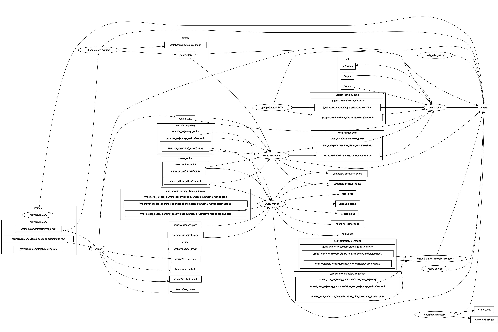
> *Generated using `rqt_graph` showing active nodes and topic connections.* Filtered out internal ROS2 nodes for clarity.

### Package-Level Interaction

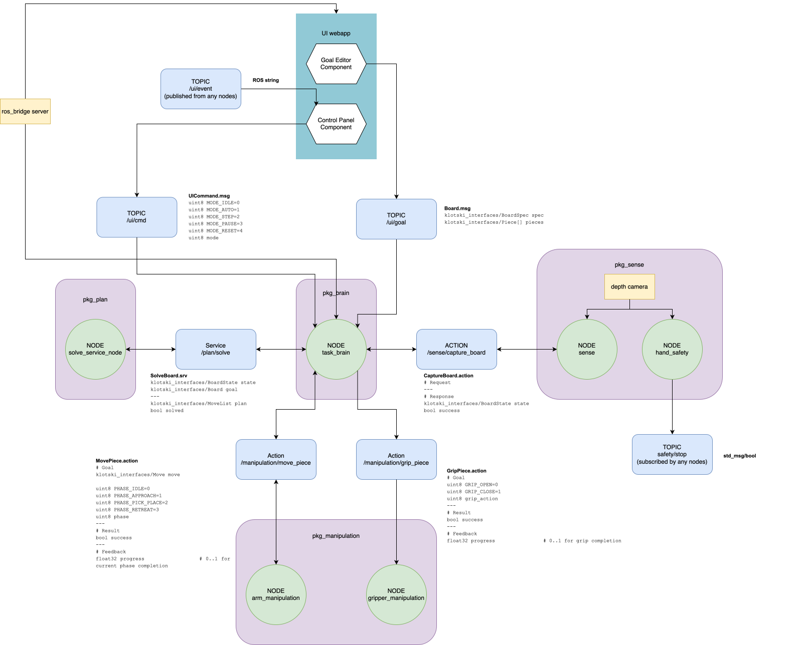

> *Interactive diagram generated with [draw.io](https://app.diagrams.net/).*

### Behaviour Tree

Below is a high-level flowchart of the system's operational loop:

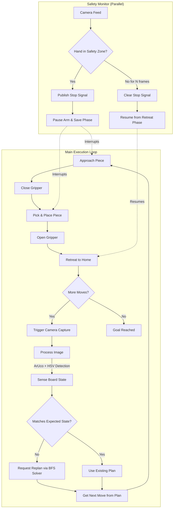

#### Brain Node
The central orchestrator that coordinates all system operations through a modular manager architecture. It manages the complete sense-plan-act loop using a 5-phase manipulation sequence (Sense -> Plan -> Approach -> Grip Close -> Pick/Place -> Grip Open -> Retreat). The node handles UI commands for mode switching (auto/step/pause/reset), subscribes to board state updates from the sense node, integrates with the safety system to pause/resume operations when hands are detected, and delegates tasks to specialised managers (UIManager, ServiceManager, ActionExecutor, PipelineOrchestrator). The pipeline orchestrator implements a **Chain of Responsibility pattern** where handlers are processed sequentially, each deciding whether to handle the current state or pass to the next handler in the chain.

#### Sense Node
An action service that processes data from the overhead RealSense camera to detect ArUco markers, compute the board pose, warp the image to a top-down view and classify each cell using HSV colour masks. It reconstructs the full Klotski board layout and publishes a BoardState message and TF frame to assist with the closed-loop planning and manipulation.

#### Hand Safety Node
Monitors the camera feed for human hands using [MediaPipe Hands detection](https://ai.google.dev/edge/mediapipe/solutions/vision/hand_landmarker). When hands are detected within a configurable polygon ROI (safety zone), it immediately publishes a stop signal on `/safety/stop`. The safety stop clears after a configurable number of consecutive frames without hands, allowing automatic resumption of operations. Provides services for dynamically adjusting the safety zone via the dashboard.

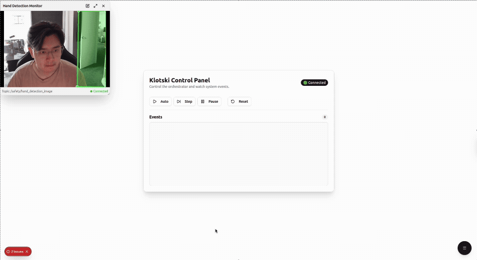

#### Plan Node
A C++ ROS2 service node that finds the optimal move sequence to solve the Klotski puzzle. Given the current board state and a goal configuration via the `SolveBoard` service, it returns the shortest `MoveList` using **BFS** over the state-space graph. The solver represents the 4×5 board as a grid with four piece types (1×1, 1×2, 2×1, 2×2) and explores valid sliding moves. [Precomputed graph data](https://2swap.github.io/Klotski-Webpage/data.json) enumerating all 65,880 reachable configurations accelerates pathfinding.

#### Arm Manipulation Node
MoveIt is been used for control UR5e robot to approach, retreat, pick and place blocks on the Klotski Board. This node subscribes to the sense node to get the real-time board coordinates and received the command from plan node with the target piece and cell.

#### Gripper Manipulation Node

### Custom ROS2 Interfaces

The system defines several custom ROS2 messages, services, and actions to facilitate communication between nodes.

<details>
<summary><strong>Messages</strong></summary>

| Message              | Description                           |
| -------------------- | ------------------------------------- |
| `Board.msg`          | Board state with piece positions      |
| `BoardSpec.msg`      | Board dimensions (4×5 grid)           |
| `BoardState.msg`     | Complete board state with pose        |
| `Cell.msg`           | Grid cell coordinates (col, row)      |
| `Piece.msg`          | Piece definition (type, color, cells) |
| `Move.msg`           | Single move (piece + target cell)     |
| `MoveList.msg`       | Sequence of moves                     |
| `HSVRange.msg`       | HSV color range for detection         |
| `HSVRanges.msg`      | Multiple color ranges                 |
| `GripperCommand.msg` | Gripper open/close commands           |
| `UICommand.msg`      | Dashboard commands                    |

</details>

<details>
<summary><strong>Services</strong></summary>

| Service                   | Description                                     |
| ------------------------- | ----------------------------------------------- |
| `SolveBoard.srv`          | Request optimal path from current to goal state |
| `CaptureBoard.srv`        | Capture and return current board state          |
| `GetHSVRanges.srv`        | Get current color detection ranges              |
| `SetHSVRanges.srv`        | Update color detection ranges                   |
| `ResetHSVRanges.srv`      | Reset to default HSV ranges                     |
| `ExportHSVRangesYaml.srv` | Export HSV config to YAML                       |
| `GetSafetyZone.srv`       | Get safety monitoring ROI                       |
| `SetSafetyZone.srv`       | Set safety monitoring ROI                       |

</details>

<details>
<summary><strong>Actions</strong></summary>

| Action             | Description                           |
| ------------------ | ------------------------------------- |
| `MovePiece.action` | Execute 5-phase manipulation sequence |
| `GripPiece.action` | Open/close gripper                    |

</details>

## 🔧 Technical Components

### Computer Vision

The vision pipeline consists of four major stages:

1. **ArUco Detection**
   - ArUco markers (DICT_4X4_50, 65mm) placed at the four corners of the board are identified
   - Marker IDs: TL=0, TR=1, BL=2, BR=3
   - Their pixel and 3D positions are stored for transformations

2. **Board Isolation**
   - The detected ArUco marker positions compute a homography matrix
   - Applied to warp the camera view into a rectified top-down view of the board

3. **Grid Color Detection**
   - A 4×5 grid is overlaid on the rectified board image
   - HSV color masks identify the color of each grid cell
   - Configurable via dashboard color masker tool

4. **Board State Reconstruction**
   - Groups neighbouring cells of the same colour to recover each Klotski piece shape
   - In Klotski, this mapping is **injective** - each color configuration uniquely determines piece arrangement


### Custom End Effector

The custom end effector is a parallel gripper driven by a single servo motor. It consists primarily of laser-cut acrylic sheet and plywood.

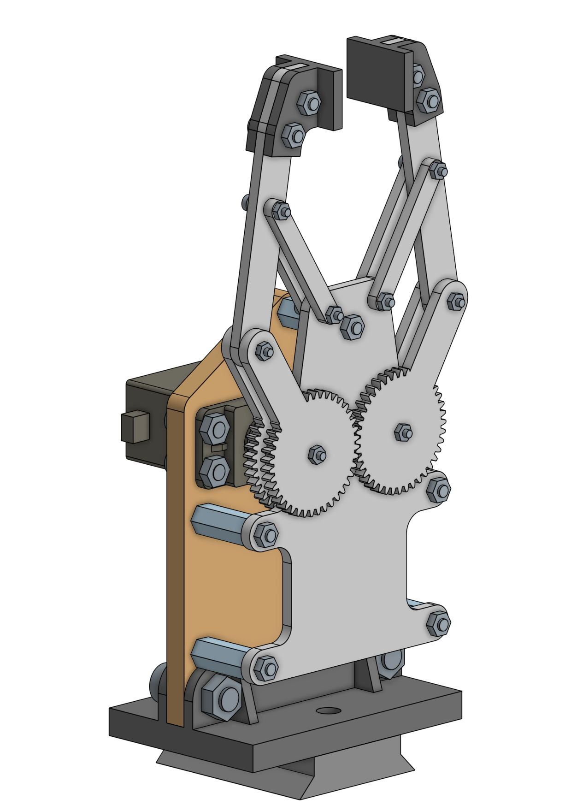

- **Control**: Arduino-based serial communication
- **Actuation**: Single servo motor for parallel jaw movement
- **Mounting**: Attaches to UR5e wrist via standard flange
- TODO: Add more details and images

### System Visualisation

Our system provides two layers of visualisation. The custom User Interface to present the puzzle goal state to clearly understand the robot’s intended solution path and progress.

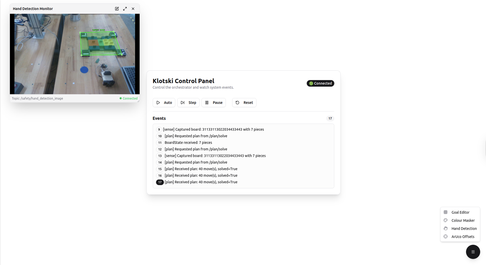

In parallel, RViz is used to display the custom end effector model with its live orientation in the world, the TF poses of all four ArUco markers and the computed board pose to verify camera calibration and to confirm correct alignment between the computer vision and robot's coordinate system:

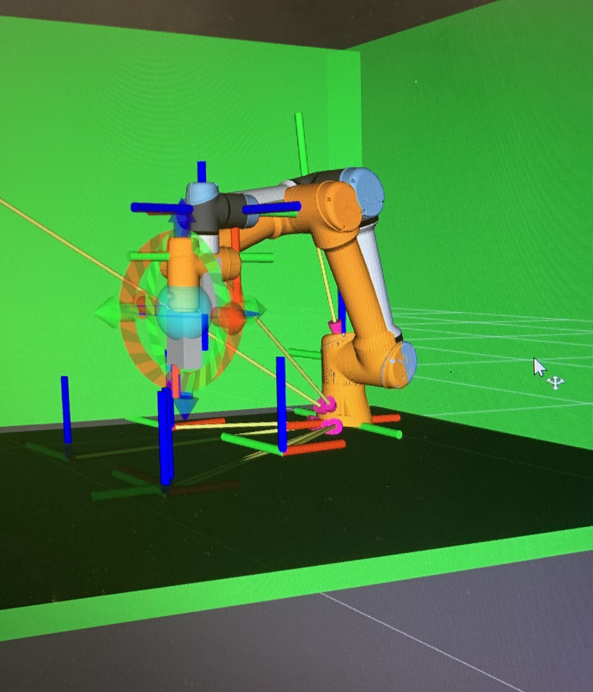

Together, these visual tools support both user clarity and technical validation of the system.

### Closed-Loop Operation

The system employs two closed-loop feedback mechanisms to ensure robust and safe execution. **Visual feedback** verifies manipulation accuracy—after each move phase, the brain node triggers a camera capture and compares the sensed board state against the **expected state** (derived by applying the intended move). If they match, execution proceeds; if not, the system automatically **replans** from the actual state to the goal, handling slippage, incomplete moves, or external interference. In parallel, a **safety feedback loop** continuously monitors for human hands via MediaPipe. When hands enter the configurable safety zone, an immediate stop signal pauses the arm and saves the current phase. Once hands clear for a set number of frames, the system resumes from a safe retreat position, allowing operators to intervene without disabling the robot.

## 🚀 Installation and Setup

### Prerequisites

#### System Requirements

- **[Ubuntu 22.04](https://releases.ubuntu.com/jammy/)**
- **[ROS2 Humble](https://docs.ros.org/en/humble/Installation/Ubuntu-Install-Debs.html)**
- **[Node.js 18+](https://nodejs.org/en/download)** and npm
- **[Python 3.10+](https://www.python.org/downloads/)**
- **[OpenCV](https://opencv.org/)** with ArUco support
- **[MoveIt2](https://moveit.picknik.ai/humble/doc/tutorials/getting_started/getting_started.html)**

#### Required ROS2 Packages

```bash
# Core packages
sudo apt install ros-humble-rclpy ros-humble-std-msgs ros-humble-sensor-msgs

# TF2 for coordinate transforms
sudo apt install ros-humble-tf2-ros ros-humble-tf2-geometry-msgs

# ROS Bridge for web interface
sudo apt install ros-humble-rosbridge-server ros-humble-web-video-server

# Camera support
sudo apt install ros-humble-realsense2-camera

# UR5e Robot Driver and MoveIt
sudo apt install ros-humble-ur-robot-driver ros-humble-ur-moveit-config

# MoveIt2
sudo apt install ros-humble-moveit

# CV Bridge
sudo apt install ros-humble-cv-bridge
```

#### Python Dependencies

```bash
pip install opencv-python mediapipe pyserial pyrealsense2 scipy
```

### 1. Clone and Build ROS Workspace

```bash
cd ~/mtrn4231-klotski-solver
colcon build
source install/setup.bash
```

### 2. Install Dashboard Dependencies

```bash
cd src/dashboard_app
npm install
```

### 3. Configuration

The system uses YAML configuration files located in each package's `config/` directory. Key parameters can be adjusted without rebuilding:

| Config File                                   | Description                                                                              |
| --------------------------------------------- | ---------------------------------------------------------------------------------------- |
| `pkg_brain/config/brain.config.yaml`          | Delay between moves, timing parameters                                                   |
| `pkg_manipulation/config/arm.config.yaml`     | MoveIt planning parameters, velocity/acceleration limits, board geometry, height offsets |
| `pkg_manipulation/config/gripper.config.yaml` | Serial port, baud rate, gripper timing                                                   |
| `pkg_sense/config/sense.config.yaml`          | Board dimensions, ArUco marker IDs/sizes, frame IDs, piece color counts                  |
| `pkg_sense/config/hand_safety.config.yaml`    | Detection confidence, safety zone ROI polygon, clear-after-frames threshold              |
| `pkg_sense/config/hsv_ranges.default.yaml`    | HSV color ranges for piece detection (can be tuned via dashboard)                        |

#### Environment Variables

The launch scripts use the following defaults that can be overridden:

| Variable   | Default         | Description                                            |
| ---------- | --------------- | ------------------------------------------------------ |
| `ROBOT_IP` | `192.168.0.100` | UR5e robot IP address                                  |
| Camera TF  | See below       | Camera-to-base transform (hand-eye calibration result) |

### 4. Camera Calibration

The system requires a camera-to-robot base transform (hand-eye calibration). This can be provided in two ways:

**Option 1: Command-line arguments** (recommended for quick adjustments)
```bash
# ./runKlotski.sh x y z qx qy qz qw
./runKlotski.sh 1.31 0.02 0.67 -0.40 0.00 0.92 0.01
```

**Option 2: Use calibration script** to compute the transform from ArUco marker observations:
```bash
# Preview camera feed and marker detection
python3 src/pkg_sense/scripts/calibrate_camera_tf.py --mode preview

# Collect calibration samples (move robot to different poses)
python3 src/pkg_sense/scripts/calibrate_camera_tf.py --mode collect --samples 20

# Compute optimal transform
python3 src/pkg_sense/scripts/calibrate_camera_tf.py --mode compute
```

See `docs/CAMERA_CALIBRATION.md` for detailed calibration instructions.

#### HSV Color Calibration

Piece color detection ranges can be calibrated via the dashboard's **Color Masker** tool:
1. Navigate to the Color Masker tab in the dashboard
2. Adjust HSV sliders while viewing the live camera feed
3. Export calibrated ranges to `hsv_ranges.default.yaml`


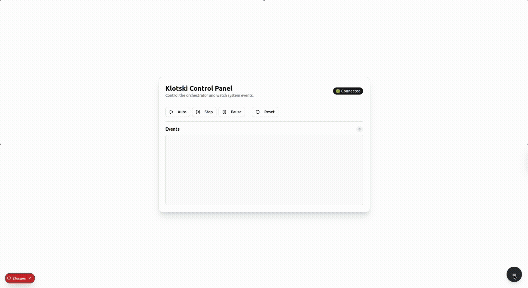


#### Hand Safety Zone Calibration
The safety monitoring ROI can be adjusted via the dashboard's **Hand Detection Viewer**:
1. Navigate to the Hand Detection Viewer tab
2. Drag the polygon vertices to define the safety zone
3. Changes are applied in real-time


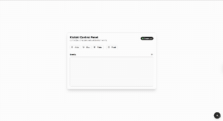

### Hardware Setup

TODO

## ⚙️ Running the System

**For Real Robot:**

```bash
# Default camera transform
./runKlotski.sh

# With custom camera transform (x y z qx qy qz qw)
./runKlotski.sh 1.31 0.02 0.67 -0.40 0.00 0.92 0.01
```

**For Simulation:**

```bash
./runKlotskiSim.sh
```

3 new terminals will open:
- **Terminal 1**: UR5e Driver Server
- **Terminal 2**: Web dashboard development server
- **Terminal 3**: Camera TF static publisher

At the terminal that ran the script, the full klotski system will launch after 5-10 seconds.

> To access the dashboard, open <http://localhost:3000> in your browser.

The system should be running with all nodes launched. Now you can ask the klotski system to solve the puzzle by:
1. Set initial board state on the physical board
2. Setting the goal board state via the dashboard's Goal Editor
   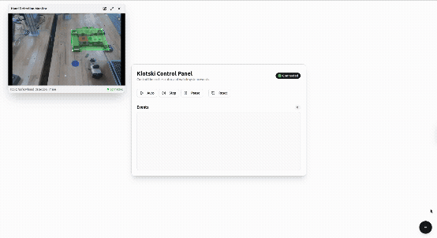
3. Clicking "Auto" or "Step" in the Control Panel
4. Observing the robot manipulate the pieces to solve the puzzle

## 🔧 Development

### Building Individual Packages

```bash
# Build specific packages
colcon build --packages-select pkg_brain pkg_sense

# Build with debug info
colcon build --cmake-args -DCMAKE_BUILD_TYPE=Debug

# Clean build
rm -rf build/ install/ log/
colcon build
```

### ROS2 Commands

```bash
# Check running nodes
ros2 node list

# Monitor topics
ros2 topic echo /board_state
ros2 topic hz /safety/stop

# Test services
ros2 service call /plan/solve klotski_interfaces/srv/SolveBoard "{...}"

# Test actions
ros2 action send_goal /arm_manipulation/move_piece klotski_interfaces/action/MovePiece "{...}"
```

## 📈 Results and Demonstration

### Working Components

During the demonstration, the following components performed successfully:

- **Dashboard UI**: The web-based dashboard provided real-time control and visualisation. Mode switching (auto/step/pause/reset), goal state editing, and HSV color tuning all functioned correctly.
- **Brain Node**: The central orchestrator successfully managed the sense-plan-act loop, handled UI commands, and coordinated the 5-phase manipulation sequence through the Chain of Responsibility pipeline.
- **Plan Node**: The BFS-based solver correctly computed optimal move sequences from the current board state to the goal configuration.
- **Sense Node (Color Detection)**: The adjustable HSV color masking via the dashboard allowed accurate detection of all piece colors. The board state was correctly reconstructed from the camera image, with the correct number and positions of pieces identified.
- **Hand Safety Node**: MediaPipe hand detection and safety zone monitoring worked as expected, pausing operations when hands entered the ROI.

### Known Issues

#### ArUco TF Frame Inaccuracy

The sense node's published ArUco marker TF frames exhibited positional offsets from their true world positions. This is likely due to:

1. **Camera intrinsic calibration drift**: The `cv2.solvePnP` function relies on accurate camera intrinsics (`fx`, `fy`, `ppx`, `ppy`, distortion coefficients). Small errors in these parameters—especially from factory defaults or environmental changes (temperature, focus)—propagate into the estimated marker pose.
2. **Hand-eye calibration residual error**: The static transform from `camera_link` to `base_link` (hand-eye calibration) may contain residual errors that compound with marker pose estimation.
3. **Marker size precision**: The configured marker length (65mm) must exactly match the physical markers; even 1-2mm discrepancy causes proportional depth errors in `solvePnP`.

As a result, the `klotski_board` frame published by the sense node did not align precisely with the physical board, causing the arm to target incorrect world positions.

#### Path Planning Failures

The MoveIt2-based arm manipulation node experienced intermittent planning failures. Contributing factors include:

1. **Constrained joint space**: The planner uses joint constraints (elbow, shoulder, wrist limits) to reduce the search space. While this speeds up planning for valid poses, it can cause failures when the target pose requires configurations outside these bounds.
2. **Cartesian path threshold**: The planner requires >70% (`cartesian_fraction_threshold`) of the Cartesian path to be achievable. For certain cell positions—especially near board edges or when the arm is in awkward configurations—this threshold may not be met.
3. **RRTConnect randomness**: The default `RRTConnectkConfigDefault` planner is probabilistically complete but not deterministic—repeated attempts with identical goals may yield different success rates.

### Demonstration Outcome

The system demonstrated successful integration of all software components. The closed-loop sense-plan-act architecture was validated: the brain node correctly triggered camera captures, the plan node computed solutions, and the UI displayed real-time state. However, full autonomous puzzle solving was not achieved due to the ArUco TF frame offsets causing the arm to miss target piece positions.

<!-- TODO: Add demonstration video (10-30s showing one full cycle) -->
<!-- TODO: Add screenshots of:
  - Dashboard UI in operation
  - RViz visualization showing TF frames
  - Camera feed with ArUco detection overlay
  - Board state detection result
-->

## 💬 Discussion and Future Work

### Engineering Challenges and How They Were Addressed

**Perception Stability**

Developing a fully closed-loop Klotski robot required overcoming several engineering challenges across computer vision, planning and manipulation. Achieving reliable perception was one of the most significant hurdles. Early testing showed that raw ArUco detections could fluctuate by several centimetres, leading to unstable board poses and unreliable planning. To address this, we combined the `cv2.solvePnP` and depth-based pose estimation with a multi-frame stability filter that rejects inconsistent readings and locks in a marker pose only when it converges within a tight threshold.

**Colour-Based Piece Classification**

Robust piece classification also posed difficulties due to colour variability, reflections, and shadows on the physical board. We addressed this by developing a carefully tuned HSV segmentation pipeline, producing clean masks and consistent grid-level classification across different lighting conditions.

**Motion Planning Reliability**

In the planning domain, MoveIt’s default Cartesian planner was often slow or prone to failure when generating full-board motions. To improve reliability, we shifted to joint-space planning with joint constraints as the primary strategy, reserving Cartesian motion for short, precise adjustments where straight-line movements were essential.

**End Effector Design and Grasp Reliability**

The end effector required several iterations to achieve reliable gripping across all piece types. We refined the gripper geometry, added sandpaper pads to increase friction, and introduced a spring mechanism to counteract backlash and improve grasp repeatability.

## 👥 Contributors and Roles

- @alanchoi00 - Project Lead, System Architecture, Brain Node, UI Dashboard, Plan Node, Hand Safety Node
- @slammyh - Sense Node, Klotski board design
- @z5324144 - Arm Manipulation Node
- @Ram0Gan35h - Gripper Manipulation Node, End Effector Design

## 📁 Repository Structure

Below is an overview of the repository structure:

```txt
mtrn4231-klotski-solver
├── camera.sh (for launching realsense camera with correct parameters)
├── docs
│   └── ... (documentation files)
├── Images
│   └── ... (README images)
├── README.md
├── runKlotski.sh (for running full klotski system on real robot)
├── runKlotskiSim.sh (for running full klotski system in simulation)
├── setupFakeur5e.sh (for setting up UR5e simulation)
├── setupRealur5e.sh (for setting up real UR5e)
└── src
    ├── dashboard_app
    │   └── ...(Next.js dashboard application)
    ├── gripper_description
    │   └── ... (custom gripper URDF)
    ├── klotski_interfaces
    │   ├── action
    │   │   └── ... (custom action definitions)
    │   ├── msg
    │   │   └── ... (custom message definitions)
    │   └── srv
    │       └── ... (custom service definitions)
    ├── klotski_utils
    │   └── ...  (shared utilities - especially for parameter handling)
    ├── launch
    │   └── klotski.launch.py (main launch file for entire system)
    ├── pkg_brain
    │   ├── config
    │   │   └── brain.config.yaml (configurable parameters)
    │   ├── launch
    │   │   └── brain.launch.py (launch file for brain node)
    │   ├── pkg_brain
    │   │   ├── context.py (context management)
    │   │   ├── handlers
    │   │   │   └── ... (event handlers - following chain of responsibility pattern)
    │   │   ├── managers
    │   │   │   └── ... (various manager files, splitting responsibilities between UI, manipulation, planning, sensing)
    │   │   ├── task_brain.py (main brain node implementation)
    │   │   └── ui_modes.py (UI mode definitions)
    │   ├── config
    │   │   ├── arm.config.yaml (configuration for arm manipulator)
    │   │   └── gripper.config.yaml (configuration for gripper manipulator)
    │   ├── launch
    │   │   └── manipulation.launch.py (launch file for manipulation nodes)
    ├── pkg_manipulation
    │   ├── arm
    │   │   └── ... (C++ MoveIt-based UR5e arm manipulator)
    │   └── gripper
    │       └── ... (Python-based serial gripper manipulator)
    ├── pkg_plan
    │   └── ... (C++ path planning node with launch file and precomputed data)
    ├── pkg_sense
    │   ├── config
    │   │   ├── hand_safety.config.yaml (hand safety node config)
    │   │   ├── hsv_ranges.default.yaml (default HSV ranges for colour detection)
    │   │   └── sense.config.yaml (sense node config)
    │   ├── launch
    │   │   └── sense.launch.py (launch file for sense node)
    │   ├── pkg_sense
    │   │   ├── constants.py (constants used across the package)
    │   │   ├── exceptions.py (custom exceptions)
    │   │   ├── hand_safety_node.py (hand safety node implementation)
    │   │   ├── handlers
    │   │   │   └── ... (handlers for service requests)
    │   │   ├── managers
    │   │   │   └── ... (various manager files, splitting responsibilities between camera, board detection, color detection, transforms)
    │   │   ├── scripts
    │   │   │   └── ... (utility scripts e.g., mock camera, calibration)
    │   │   ├── sense_node.py (main sense node implementation)
    │   │   ├── services
    │   │   │   └── ... (FP service implementations)
    │   │   └── types.py (custom types used in the package)
    │   ├── scripts
    │   │   └── calibrate_camera_tf.py (script for calibrating camera transform)
    │   └── test_images (test images for mock camera)
    └── ur_with_gripper_description
        └── ... (UR5e with gripper URDF)
```

> Tree generated with `tree -L 4 -I 'build|install|log|node_modules'`

<details>

<summary><strong>Further details on repository structure - package level</strong> (click to expand)</summary>

<br/>

### `klotski_utils/`

Shared Python utilities across packages.

- `params.py` - Type-safe ROS2 parameter declaration helper (`declare_param[T]()`)

### `pkg_brain/`

**Task Orchestrator** - Central coordination node managing the complete solving pipeline.

**Node:** `task_brain`

**Responsibilities:**

- UI mode management (auto/step/pause/reset)
- Pipeline orchestration through handler chain
- 5-phase manipulation execution (IDLE -> APPROACH -> PICK_PLACE -> RETREAT)
- Safety stop integration

**Subscriptions:**

| Topic          | Type         | Description                |
| -------------- | ------------ | -------------------------- |
| `/board_state` | `BoardState` | Current sensed board state |
| `/ui/cmd`      | `UICommand`  | Dashboard commands         |
| `/ui/goal`     | `BoardState` | User-defined goal state    |
| `/safety/stop` | `Bool`       | Emergency stop signal      |

**Publications:**

| Topic        | Type     | Description                  |
| ------------ | -------- | ---------------------------- |
| `/ui/events` | `String` | Status updates for dashboard |

**Service Clients:**

| Service       | Type         | Description           |
| ------------- | ------------ | --------------------- |
| `/plan/solve` | `SolveBoard` | Request path planning |

**Action Clients:**

| Action                             | Type        | Description      |
| ---------------------------------- | ----------- | ---------------- |
| `/arm_manipulation/move_piece`     | `MovePiece` | Arm manipulation |
| `/gripper_manipulation/grip_piece` | `GripPiece` | Gripper control  |

### `pkg_sense/`

**Computer Vision Module** - Board state detection via camera and ArUco markers.

**Nodes:**

| Node                  | Description                                                           |
| --------------------- | --------------------------------------------------------------------- |
| `sense`               | Main sensing node - ArUco detection, board isolation, color detection |
| `hand_safety_monitor` | Hand detection for safety stopping using MediaPipe                    |

**Vision Pipeline:**

1. **ArUco Detection** - Detect 4 corner markers (IDs 0-3, DICT_4X4_50, 65mm)
2. **Board Isolation** - Homography transform for top-down rectified view
3. **Color Detection** - HSV masking for piece identification per grid cell
4. **Board Reconstruction** - Merge same-colour cells into corresponding pieces

**Subscriptions:**

| Topic                              | Type         | Description       |
| ---------------------------------- | ------------ | ----------------- |
| `/camera/camera/color/image_raw`   | `Image`      | Camera feed       |
| `/camera/camera/color/camera_info` | `CameraInfo` | Camera intrinsics |

**Publications:**

| Topic                          | Type         | Description                    |
| ------------------------------ | ------------ | ------------------------------ |
| `/board_state`                 | `BoardState` | Detected board state with pose |
| `/safety/stop`                 | `Bool`       | Hand detection safety signal   |
| `/safety/hand_detection_image` | `Image`      | Annotated hand detection feed  |

**TF Broadcasts:**

| Frame     | Parent                       | Description                       |
| --------- | ---------------------------- | --------------------------------- |
| `aruco_X` | `camera_color_optical_frame` | Individual marker poses           |
| `board`   | `base_link`                  | Board origin (bottom-left corner) |

**Services:**

| Service                 | Type            | Description           |
| ----------------------- | --------------- | --------------------- |
| `/sense/capture_board`  | `CaptureBoard`  | Capture current state |
| `/sense/get_hsv_ranges` | `GetHSVRanges`  | Get color ranges      |
| `/sense/set_hsv_ranges` | `SetHSVRanges`  | Set color ranges      |
| `/safety/get_zone`      | `GetSafetyZone` | Get safety ROI        |
| `/safety/set_zone`      | `SetSafetyZone` | Set safety ROI        |

### `pkg_plan/`

**Path Planning Module** - BFS-based Klotski solver with precomputed move database.

**Node:** `solve_service_node` (C++)

**Algorithm:**

- Uses precomputed adjacency graph (`possible_combinations.json`) of all valid Klotski states
- BFS search from current state to goal state
- Returns optimal move sequence

**Services:**

| Service       | Type         | Description          |
| ------------- | ------------ | -------------------- |
| `/plan/solve` | `SolveBoard` | Compute optimal path |

### `pkg_manipulation/`

**Robot Control Module** - UR5e arm and gripper control using MoveIt2.

**Nodes:**

| Node                  | Description                                          |
| --------------------- | ---------------------------------------------------- |
| `arm_manipulator`     | MoveIt-based arm motion planning and execution (C++) |
| `gripper_manipulator` | Arduino-controlled servo gripper via serial (Python) |

**Arm Manipulator Features:**

- Cartesian path planning for predictable linear motions
- Dynamic board pose subscription for accurate targeting
- Collision objects (table, walls, ceiling)
- Safety stop integration with immediate motion halt
- Configurable velocity/acceleration scaling

**Action Servers:**

| Action                             | Type        | Description          |
| ---------------------------------- | ----------- | -------------------- |
| `/arm_manipulation/move_piece`     | `MovePiece` | 5-phase manipulation |
| `/gripper_manipulation/grip_piece` | `GripPiece` | Gripper control      |

**5-Phase Manipulation Sequence:**

1. **IDLE** - Ready state
2. **APPROACH** - Move above piece center
3. **PICK** - Descend to grip height, close gripper
4. **PLACE** - Move to target, open gripper
5. **RETREAT** - Rise to safe height

### `gripper_description/`

URDF description for the custom gripper end effector.

### `ur_with_gripper_description/`

Combined URDF for UR5e robot with custom gripper attached.

### `dashboard_app/`

**Web Interface** - Next.js application for real-time control and visualization.

**Technology Stack:**

- Next.js 14 + React 18
- TypeScript
- Tailwind CSS + shadcn/ui components
- roslib.js for ROS2 WebSocket communication

**Features:**

- Real-time board state visualization
- Interactive goal state editor
- Mode control (auto/step/pause/reset)
- HSV color range tuning
- Camera feed with safety zone overlay
- Hand detection monitor with ROI editing

**Key Components:**

| Component             | Description                            |
| --------------------- | -------------------------------------- |
| `ControlPanel`        | Mode buttons and system control        |
| `GoalEditor`          | Interactive goal state configuration   |
| `ColourMasker`        | HSV range adjustment with live preview |
| `HandDetectionViewer` | Safety zone visualization and editing  |

### `src/launch/`

Main launch configuration for the complete system.

**`klotski.launch.py`** - Launches all nodes:

- rosbridge_server (WebSocket)
- web_video_server (camera streaming)
- ur_moveit (robot driver + MoveIt)
- pkg_manipulation (arm + gripper)
- pkg_plan (solver)
- pkg_sense (vision + safety)
- pkg_brain (orchestrator)

</details>

## 🗿 References and Acknowledgements

### References

- Ros2 Web Bridge. Robot Web Tools, https://github.com/RobotWebTools/ros2-web-bridge
- Ros2 Bridge. Robot Web Tools, https://github.com/RobotWebTools/rosbridge_suite
- MediaPipe Hand Landmarker. Google, https://ai.google.dev/edge/mediapipe/solutions/vision/hand_landmarker
- Librealsense(pyrealsense2). Intel RealSense, https://github.com/realsenseai/librealsense
- Vision Opencv (Cv Bridge). ROS Perception, https://github.com/ros-perception/vision_opencv
- Klotski Webpage. 2swap, https://2swap.github.io/Klotski-Webpage/data.json

### Acknowledgements
We would like to thank our tutor, David Nie, for his careful guidance and dedicated support throughout our project. David provided us with many valuable suggestions that greatly improved our work.

We would also like to thank our course convenor, Will Midgley, for providing the project topic and for his support during the course.

## Drawings
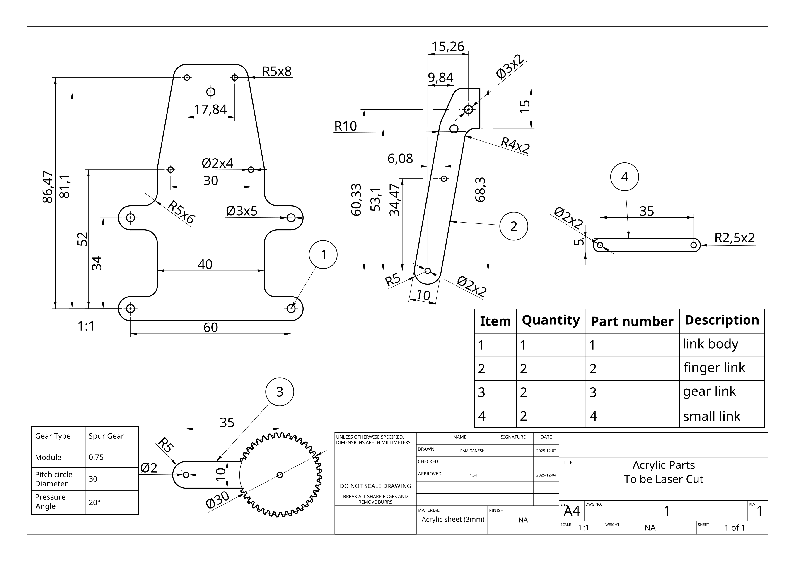
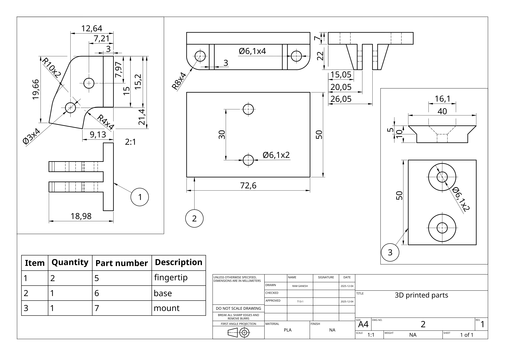
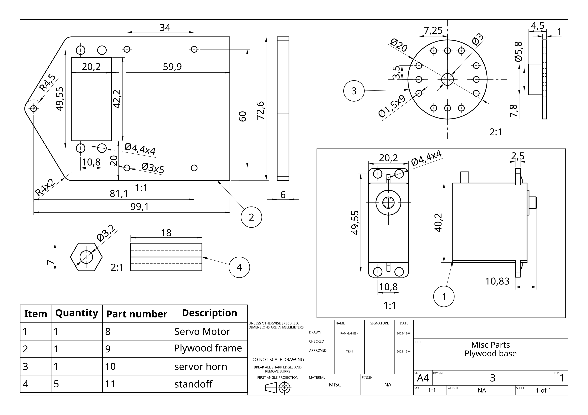
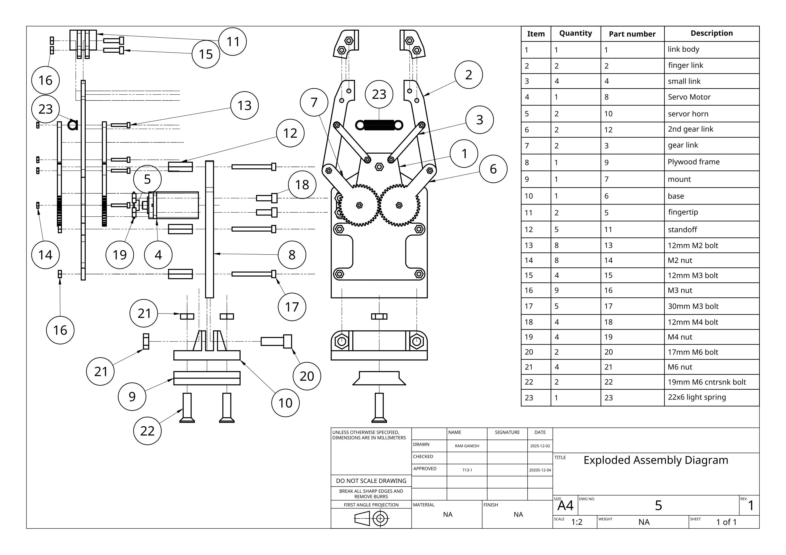
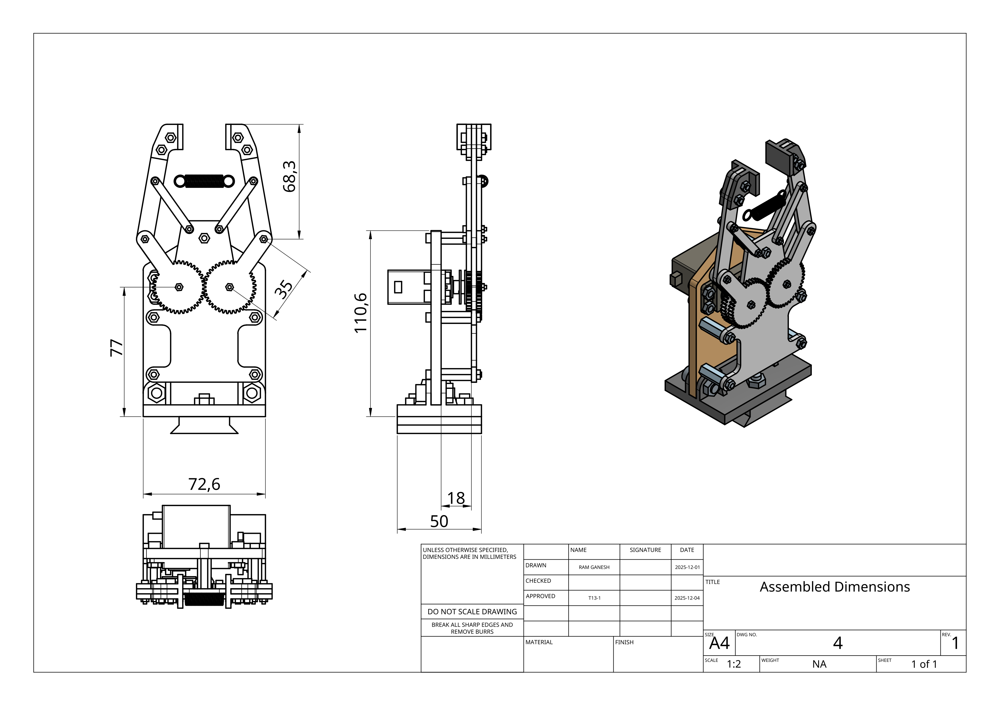

## 📄 License

This project is developed for MTRN4231 coursework at UNSW. Please don't steal our work :)
